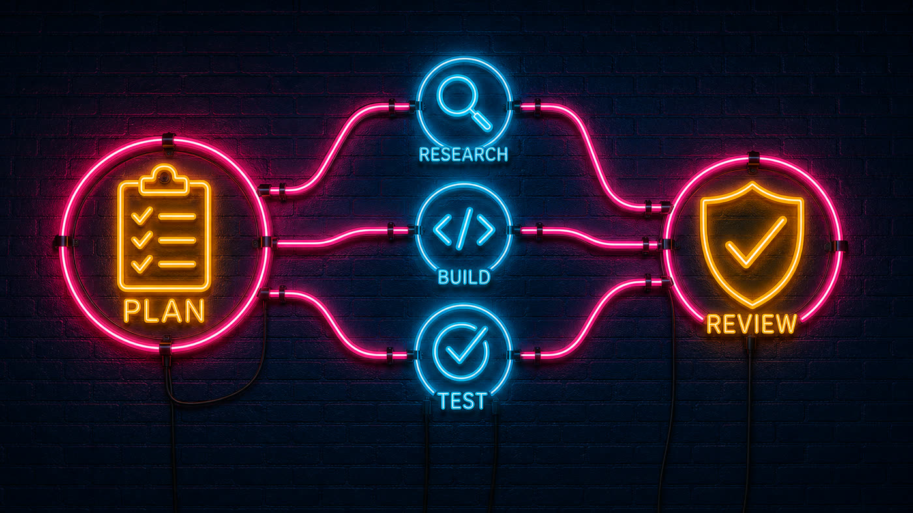
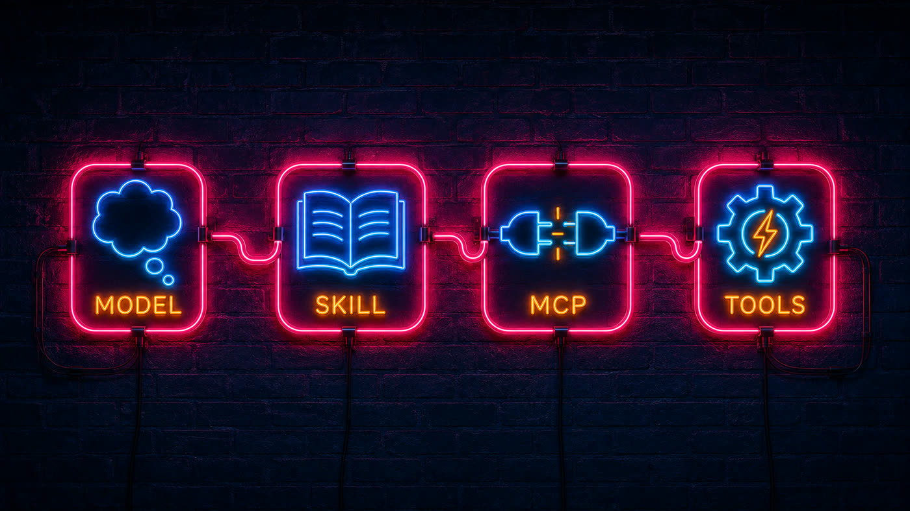
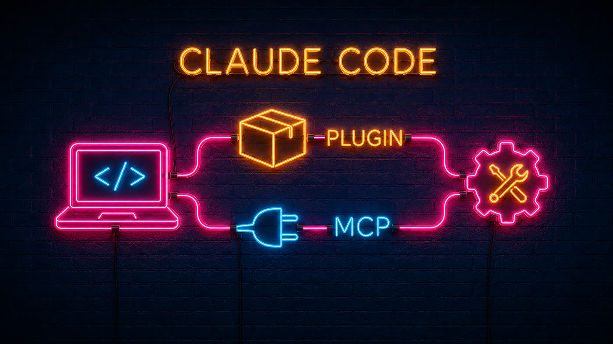
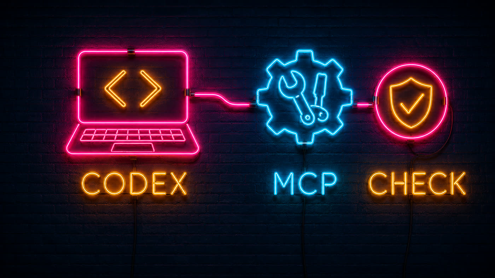
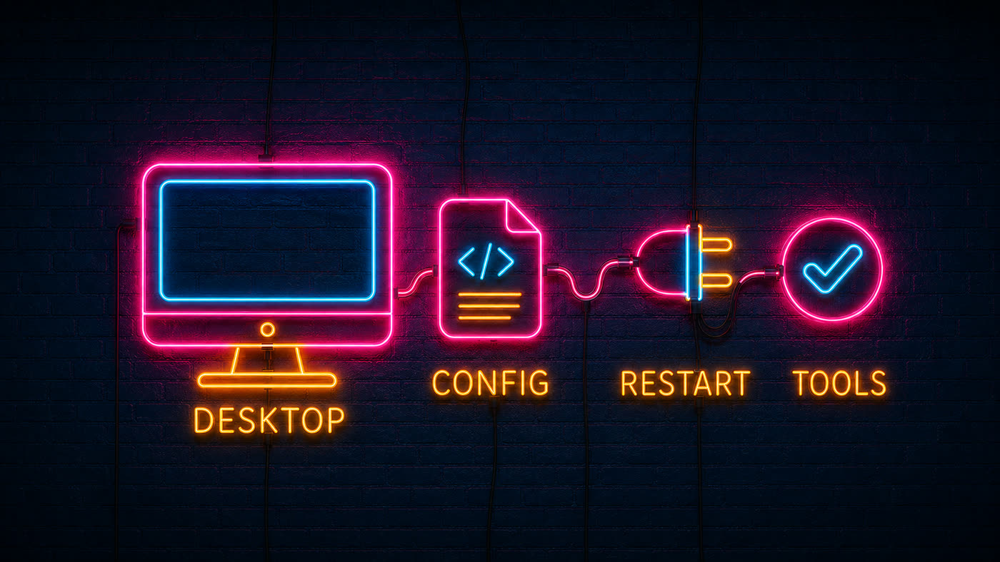
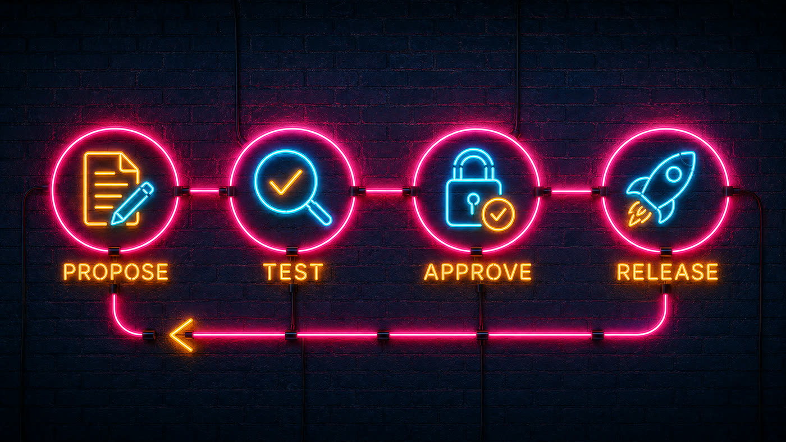
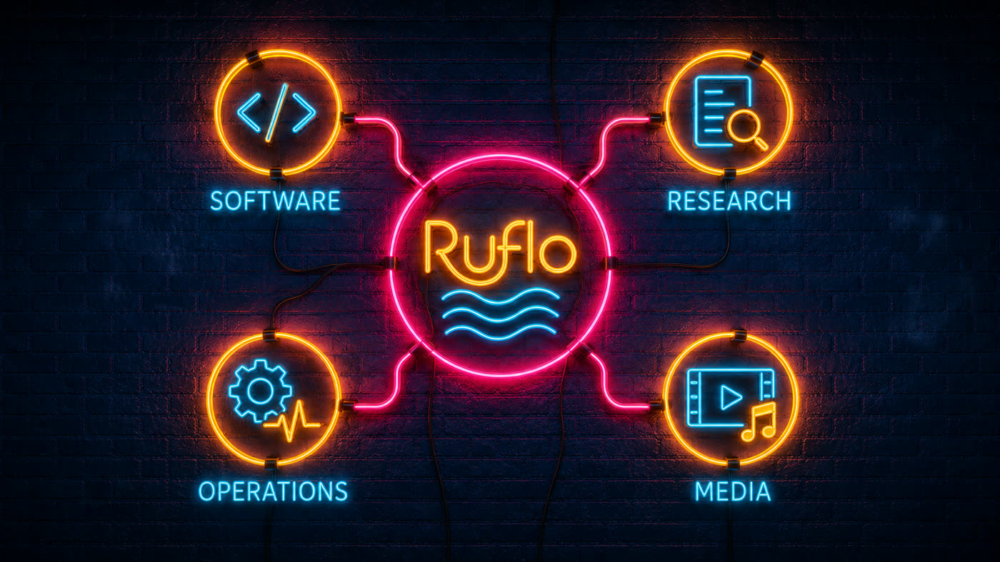
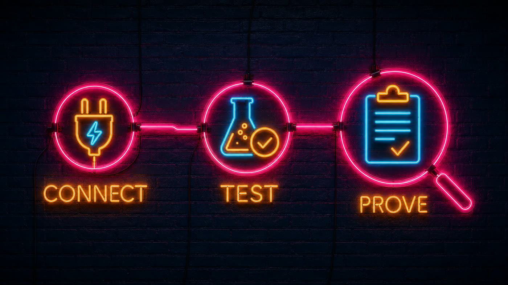

# RuFlo Explained: Build an AI Team That Plans, Remembers, Tests, and Improves

*By rUv Cohen — Agentic Engineer / Founder @ Cognitum.One · September 7, 2026*

> Originally published on [LinkedIn](https://www.linkedin.com/pulse/ruflo-explained-build-ai-team-plans-remembers-tests-improves-cohen-kdyxc).

Most people meet AI through a chat window. You ask a question, get an answer, and decide what to do next.

But real work rarely ends with one answer. A feature needs research, code, tests, a review, and a record of the decisions. A research project needs sources, comparisons, and someone checking whether the conclusion actually follows from the evidence.

I built RuFlo to help organize that work. This guide takes you from the basic idea to a first useful task, then shows how memory, agent teams, plugins and evaluation fit together.

**Choose your path:** Sections 1 to 3 explain the system. Sections 4 to 9 cover setup. Sections 10 to 14 show practical workflows, cost, verification and what comes next. You do not need to install every integration.

The simplest explanation: RuFlo gives an AI assistant a structured way to work with other agents, use tools, remember useful context, and check results.

You still choose the goal. Your AI model still does the reasoning. RuFlo provides more of the machinery around the work.

This is a practical introduction for people starting with Claude, Codex, ChatGPT, or Grok. You do not need a large swarm or every plugin. Start with one useful task and add complexity only when it earns its place.

---

## 1. Think of it as a workshop, not another chatbot


*Plan fans out to research, build and test, then converges on review.*

A model is the person thinking through the problem. A skill is a playbook. A tool is a piece of equipment. Memory is the project notebook. RuFlo helps coordinate the workshop.

Suppose you ask: *"Review this application and propose a safer login flow."*

One agent can inspect the current code. Another can look for security problems. A third can design tests. Their work can feed into a single recommendation, with the important findings retained for the next session.

That is the idea behind an agent swarm. It means several focused workers sharing a goal, not a crowd of bots talking indefinitely.

Claude Code and Codex already have powerful native features. RuFlo does not make them capable for the first time. It adds another layer of coordination, memory, workflows, and integrations that you can use selectively.

A team of agents is useful when the work can be divided. A single agent is often better for a small, straightforward change.

> **Try it:** Ask for a project map, a test plan and a security review as three separate outputs. Let one coordinator resolve conflicting findings. If the task is only a two line edit, keep it with one agent.

---

## 2. Four pieces that are easy to confuse


*The four pieces that are easy to confuse, in order.*

**The model:** Claude, GPT, Grok, or another supported model supplies reasoning and language generation. RuFlo is not a replacement set of model weights.

**A skill:** instructions that teach a compatible agent how to approach a task. Installing a skill gives the assistant a playbook. It does not, by itself, start a server or grant access to your files.

**MCP:** Model Context Protocol is a standard way for an assistant to discover and call tools. Connecting the RuFlo MCP server lets a compatible client request operations such as checking health or searching project memory.

**The runtime and plugins:** the software that performs the operations. Plugins package additional capabilities. Some also include skills, commands, or hooks that respond to events.

These pieces fit together, but they are not interchangeable. "I installed the skill" and "the MCP server is connected" are two different statements.

> **Try it:** Ask your assistant to name its model, identify the installed RuFlo skill, list the connected MCP server and call one harmless tool. Four clear answers are more useful than a general claim that everything is installed.

---

## 3. What RuFlo can help you do


*Documents, search and findings feeding a shared project memory.*

The project has a broad capability surface. Here is the useful map, without requiring you to learn every internal name.

**Plan and coordinate work.** Break a goal into tasks, assign roles, track dependencies, and combine results. Hierarchical coordination gives one coordinator responsibility for integration. Other coordination patterns suit different workloads. Choose the simplest arrangement that works.

**Keep useful project memory.** Store decisions, findings, and reusable context. AgentDB and RuVector provide parts of the memory and retrieval stack. Search can find related meaning rather than only an exact word. The benefit is less repeated investigation, provided the stored information remains accurate and appropriately scoped.

**Learn from previous attempts.** ReasoningBank, SONA, and related components work with experience, patterns, and feedback. Think "reuse evidence from what worked," not "the underlying commercial model automatically retrains itself." Learning features still need evaluation and sensible promotion rules.

**Build repeatable workflows.** Combine planning, implementation, testing, documentation, and review. SPARC is one structured development approach in the project. Architecture decision records capture why a choice was made, so a future agent does not have to guess.

**Inspect and test software.** Use development, browser automation, review, and testing integrations where configured. Ask for actual test output and a description of what was checked. An agent saying "done" is not a test result.

**Add security checks.** Security and AIDefence capabilities can support audits and threat detection. They complement scoped credentials, isolated environments, and approval gates. No plugin makes arbitrary tool execution automatically safe.

**Observe cost and progress.** Health checks, logs, task state, and cost tracking help answer what ran, what failed, and what it consumed. A green check for one component is not proof that every integration works.

**Connect more environments.** Provider integrations, local model options, federation, and specialized plugins extend the system. Some components use Rust or WebAssembly for acceleration. Compatibility, hardware, and operational requirements vary by feature.

**Improve the harness itself.** MetaHarness capabilities support evaluating and refining the workflow around the model. A proposed improvement should be tested against a baseline before becoming the default. Better sounding instructions are not necessarily better performing instructions.

There are also optional domain plugins, including IoT and market data tools. They are extensions, not prerequisites for getting started. Financial integrations require their own permissions and risk controls.

The RuFlo README is the live capability index. Treat its feature list as a map to investigate, not a claim that every feature is enabled in your installation.

### A practical plugin map

Start with `ruflo-core` for the foundation. Use `ruflo-swarm` for coordinated teams, `ruflo-goals` for task planning, and `ruflo-workflows` for repeatable sequences. Autopilot and loop workers are for recurring or continuing work, so define a budget and a stopping condition first.

For knowledge, `ruflo-agentdb`, `ruflo-rag-memory`, `ruflo-rvf`, `ruflo-ruvector` and `ruflo-knowledge-graph` cover different storage, retrieval and relationship needs. In simple terms, a database keeps the notes, search finds useful notes, and a graph records how things connect. They are not five mandatory installations.

For development, the code review, testing and browser plugins help inspect changes and check behavior. ADR records the reason for a decision. SPARC organizes development into stages. DDD helps organize software around business concepts. Choose the method that makes your project easier to understand, rather than adding a methodology because it exists.

Security audit and AIDefence add checks; they do not replace secure permissions. Federation connects agent installations on different machines and therefore introduces a network trust boundary. Local model routing can change where inference runs, but inspect each data path before claiming the whole workflow is private.

MetaHarness focuses on the setup around the agent: readiness, configuration risks, snapshots and regressions. Treat a score as a diagnostic signal, not a guarantee. The repository plugin catalog is the starting point for optional capabilities and their individual documentation.

**Example: a support knowledge assistant.** Give it approved product documentation, retrieve relevant passages for each question, and require citations in its answer. Log unanswered questions. Review proposed additions before placing them in shared memory. The result improves because the knowledge and checks improve, not because every answer is automatically correct.

> **Try it:** Store a short architecture decision with its source, date and owner. In a fresh session, ask the assistant to retrieve it and explain whether it is still relevant. Correct retrieval matters more than simply proving something was stored.

---

## 4. The shortest useful starting point: install the skill


*Skill, then project, then ready — in that order.*

If your coding assistant supports the Skills installer, run this in a terminal:

```bash
npx skills add ruvnet/ruflo --skill ruflo
```

Choose the supported agent and installation scope when prompted. A project installation is easier to reason about than immediately changing every project on your machine.

The command is `skills`, plural. I checked the repository listing: it exposes a skill named `ruflo`.

This gives a compatible agent instructions for working with RuFlo. It is not a universal command for every chat application. A hosted ChatGPT conversation cannot launch your laptop's `npx` process just because you paste this command into chat.

Next, ask your assistant:

> Use the RuFlo skill to explain what is installed and what is not. Do not change files or connect services yet. Propose the smallest setup for a read only review of this project.

**Practical takeaway:** first confirm the assistant can see the skill. Then connect only the tools needed for your first task.

> **Success check:** The assistant can explain the RuFlo skill and its limits without modifying your project. If it cannot find the skill, check which client and installation scope you selected before installing additional packages.

---

## 5. Claude Code: choose plugins or a direct MCP connection


*Two paths into Claude Code: plugin or a direct MCP connection.*

For Claude Code users who want the packaged experience, these are commands **inside Claude Code**, not ordinary shell commands:

```
/plugin marketplace add ruvnet/ruflo
/plugin install ruflo-core@ruflo
```

Start with core. Add coordination or memory plugins when you have a specific need:

```
/plugin install ruflo-swarm@ruflo
/plugin install ruflo-rag-memory@ruflo
```

The core package provides the MCP integration. Installing a plugin is not the same as initializing every project hook or background service.

If you prefer a direct MCP registration instead, use your terminal:

```bash
claude mcp add ruflo -- npx --yes ruflo@3.38.23 mcp start
claude mcp list
```

Choose one connection path first. Adding a second copy of the same server can make tool discovery confusing.

These examples pin the npm release I checked, `3.38.23`, rather than silently changing with a future release. The package declares Node.js 20 or newer. Use a currently supported Node release that satisfies that requirement.

See Anthropic's MCP setup documentation for client permissions and troubleshooting.

> **Success check:** Claude Code lists one intended RuFlo server and can run a health check. The lite plugin route does not install the same hooks and project scaffolding as the full initialization route. Inspect the proposed changes before choosing the larger setup.

---

## 6. Codex: connect the same tool server


*Codex connects to the same tool server, then you check the result.*

Codex CLI supports a similar local MCP registration:

```bash
codex mcp add ruflo -- npx --yes ruflo@3.38.23 mcp start
codex mcp list
```

You can also use the project's Codex initialization path:

```bash
npx --yes ruflo@3.38.23 init --codex
```

Initialization writes project configuration. Review the changes, especially in an existing repository. Test in a disposable project before applying a broad setup to important work.

Ask Codex to list the available RuFlo tools, run a health check, and explain the result. Do not treat a configuration entry as proof that the process connected successfully.

The Codex MCP documentation covers configuration and supported transports.

> **Success check:** Codex discovers the server, performs one read only call and returns the actual result. If registration succeeds but execution fails, check the executable path, working directory and required environment variables before blaming the model.

---

## 7. Claude Desktop: local tools, separate setup


*Claude Desktop needs its own config, a restart, and a tool check.*

Claude Desktop's local MCP configuration is separate from Claude Code. Use its documented local server setup and **merge** a RuFlo entry into the existing configuration rather than replacing other servers:

```json
{
  "mcpServers": {
    "ruflo": {
      "command": "npx",
      "args": ["--yes", "ruflo@3.38.23", "mcp", "start"]
    }
  }
}
```

Your desktop app must be able to find Node and `npx`. Restart the client after configuration and confirm that the tools appear. A command working in your terminal does not guarantee the desktop app has the same executable search path.

> **Success check:** After restarting Claude Desktop, ask it to identify the connected RuFlo tools and perform one safe call. A common setup issue is that the desktop application has a different executable search path from your terminal.

---

## 8. ChatGPT: a hosted connection is different


*A hosted client needs an authenticated remote endpoint, not a local command.*

ChatGPT on the web needs a reachable **remote** MCP endpoint, not a local stdio command. The current developer mode documentation lists support on eligible paid plans, subject to workspace controls.

Enable developer mode under Settings → Security and login. In Plugins, create the developer mode app using your administrator's authenticated remote MCP URL, then select the permitted tools.

A RuFlo deployment must supply that remote endpoint or an appropriate gateway. This guide does not assume the project website is an MCP endpoint. Do not expose a local command server to the internet without authentication, tool restrictions, and operational ownership.

Start with a narrow read only tool set. Follow the official ChatGPT developer mode instructions, because menu names and availability can change.

> **Success check:** Confirm the exact server URL with its operator, authenticate, discover the intended tools and run one permitted read. Test that an unauthorized operation is refused. Do not use an unauthenticated public tunnel for a server that can read files or execute commands.

---

## 9. Grok, Grok Bot, and Grok Build are different surfaces


*CLI, web and bot are three different surfaces with different permissions.*

Grok Build CLI documents local MCP connections. Its documented command pattern can be used for RuFlo:

```bash
grok mcp add ruflo -- npx --yes ruflo@3.38.23 mcp start
grok mcp list
grok mcp doctor ruflo
```

This is a configuration example based on the Grok Build MCP documentation, not a claim that I tested your Grok installation. Grok Build also supports skills and plugins, but inspect compatibility before importing an entire agent bundle.

Grok on the web documents custom connectors using a remote server URL and authentication. As with ChatGPT, a public website URL and a secured MCP endpoint are not the same thing.

Grok Bot has its own managed environment and available integrations. Its account capabilities may differ. Use the Grok Bot documentation and begin by asking it to identify which terminal, skill, and connector options are actually available:

> Check whether this environment supports a local RuFlo MCP process or a remote authenticated connector. Report the available path and permissions before installing anything. Do not assume access to my laptop.

The lesson across all four ecosystems is simple: **the skill teaches the workflow, MCP connects tools, and the host decides where those tools can run.**

> **Success check:** Ask Grok to identify whether it is running in a CLI, browser or managed bot environment, then explain the available connection method. Do not treat a CLI command as evidence that the same integration exists in a web account.

---

## 10. Your first real task: a bounded project review


*Propose, test, approve, release — then loop.*

Use a small project without secrets. Begin with inspection, not deployment.

> Review this project using RuFlo where useful. First summarize its purpose and how to run its tests. Propose three independent review tasks. Keep the first pass read only. Do not install dependencies, send source code to additional services, edit files, publish, or deploy. Return findings with file references, uncertainties, and the exact checks you ran.

After reviewing the plan, authorize one specific change. Give the agent a clear acceptance test and a stopping condition.

> Implement only the agreed input validation change. Preserve unrelated work. Run the relevant tests. Show the diff, test results, and any remaining risks. Stop before committing or deploying.

That is a useful end to end workflow: goal, plan, scoped execution, evidence, review. It is also easier to debug than enabling dozens of agents at once.

> **Try it:** Use a small repository with no secrets. Save the baseline test result, approve one input validation fix and compare the same tests afterward. The deliverable is the change plus evidence, not a message saying done.

---

## 11. Where this becomes valuable


*One core across software, research, operations and media.*

**Shipping software:** separate implementation, testing, and review so the same agent is not the only judge of its own work.

**Understanding an unfamiliar repository:** map the architecture, find entry points, document assumptions, and keep the findings available for the next task.

**Research and analysis:** divide source gathering, comparison, and verification. Store citations alongside conclusions. Tool access does not make an unsupported claim true.

**Operational runbooks:** turn repeated checks into workflows with owners, logs, and explicit escalation rules. Start with diagnostics before allowing remediation.

**Content and media production:** coordinate research, drafting, asset generation, and review through approved integrations. The model can propose a post or video; publishing and paid generation still require the permissions and budgets you establish.

**Long running projects:** retain decisions and evaluated patterns so new sessions spend less time reconstructing the past.

> **Try it:** Choose one repeated job you already do weekly. Write down its inputs, expected outputs, spending limit and reviewer. Build that workflow first. For a media example, require a script, visual plan, asset receipts, audio check and final review before publishing.

---

## 12. Cost: more agents are not automatically cheaper


*Time and cost only matter against delivered value.*

The potential savings come from avoiding repeated work, retrieving the right context, using an appropriate model for each task, and catching mistakes earlier.

Parallel work can reduce waiting while increasing token usage. A simple illustration: three independent tasks take ten minutes each. Doing them sequentially takes thirty minutes. Running them together could take ten minutes plus five minutes of integration, about fifteen minutes total. That does not mean half the model bill. Integration and duplicated context may increase it.

This is an illustration, not a RuFlo benchmark. Dependencies, provider limits, and retries change the result.

Measure **cost per accepted result**: model usage, tool charges, infrastructure, retries, and human review. A cheaper run that produces unusable work is not a saving.

My starting rule: one coordinator, a few genuinely independent tasks, a fixed budget, and a clear finish line.

> **Try it:** Run the same small task once with one agent and once with a small team. Record elapsed time, total charges, retries, reviewer minutes and whether the acceptance test passed. Keep the version that produces the better accepted result at the right cost.

---

## 13. What I verified, and what you should verify


*Connection is not proof; execution and evidence are.*

The initial article validation checked npm release `3.38.23`, the published skill listing, initialization help, and MCP tool discovery. The CLI reported 333 tools. That count describes the available interface, not 333 capabilities proven in your environment.

```bash
npx --yes ruflo@3.38.23 --version
npx --yes ruflo@3.38.23 doctor
npx --yes ruflo@3.38.23 mcp tools
npx --yes ruflo@3.38.23 mcp exec --tool system_health
```

A configured connection passed its memory, configuration, and MCP process checks. The same health command in an uninitialized temporary directory correctly reported missing configuration and memory. Some advanced subsystem checks reported `unknown`, not `healthy`. Environment matters.

In this release, `doctor --fix` prints suggested commands; it should not be described as automatically repairing everything.

Before trusting a workflow, verify tool discovery, permissions, actual execution, and output. A registered agent or task record is not evidence that the work ran.

> **Success check:** Save a small receipt containing the tool name, input scope, result, timestamp, cost and test evidence. Repeat in a fresh session. If you cannot reproduce the result, investigate before adding more autonomy.

---

## 14. Working across machines: the open swarm federation

Everything above runs on one machine. The federation lets agents on *different* machines — your laptop, a Windows box, a Linux server, a cloud desktop, or another person's setup entirely — see each other, share status, hand off work, and agree on who owns what. Every message is cryptographically signed by whoever sent it, so you always know who said what.

There are two ways to federate, and you can use either or both:

- **Private mesh (agentbbs).** Machines you control pin each other's keys and pull each other's rooms over plain HTTP. Works on a LAN, VPN, or Tailscale — no special network required. Good for your own fleet.
- **Open swarm at x.ruv.io.** A shared, membership-gated Nostr relay fronted by `https://x.ruv.io`. Anyone with an invite can join *as themselves* — the invite is redeemed with a key that lives only on their machine, so no admin ever holds their identity. Good for collaborating with people and agents you do not administer.

**Joining the open swarm takes one command (RuFlo 3.41.0+):**

```bash
npx ruflo federation join --code v2.…      # invite code, shared with you privately
npx ruflo federation roster                # who is online
npx ruflo federation sync                  # what the swarm has posted
npx ruflo federation claims                # who owns which piece of work
```

The first command generates a key at `~/.ruflo/nostr.key` (readable only by you), redeems the invite directly against the relay, and confirms your membership. From then on you publish as yourself.

**Claims keep agents from colliding.** Before starting shared work, an agent posts a claim on a resource; one owner per resource, first valid claim wins, only the owner can release or hand off. Check `federation claims` before you begin, and you will not duplicate someone else's effort.

**Seraphina is the swarm's coordinator.** Give her a goal and she reads the live roster, the claims board, and recent messages, then returns plain guidance plus concrete proposals — which node should take what, and what could go wrong. She reasons through the cognitum meta-llm gateway, which picks the cheapest model tier that can handle the question. Her proposals are advice, not orders: an operator publishes the ones they accept. She is available as the `seraphina_guidance` tool on `x.ruv.io/mcp` and inside RuFlo.

**Security, in one paragraph.** Signed messages give verifiable authorship. Membership is invite-gated and every connection is authenticated (NIP-42). Anything the gateway does under its *own* identity — minting invites, admitting members, broadcasting — requires an admin token and is rate-limited; ordinary users never touch that path. Message content is treated as data, never as instructions to an agent. And the one rule to remember: **never put a secret in a federation message.**

**Your acceptance test for federation:** join with an invite, see yourself on the roster, claim one resource, and confirm a second machine sees your claim. If that round-trip works, you can trust the rest.

## 15. The direction: assistants that carry work forward


*You stay at the centre of plan, act, check, learn.*

The interesting shift is from asking AI for an answer to giving it a bounded responsibility.

An assistant that can plan, use tools, keep useful memory, and evaluate its attempts can carry more of a project between conversations. But autonomy only helps when the result remains understandable and controllable.

I want the system to remember what worked without preserving yesterday's mistakes, delegate without multiplying confusion, and move faster without quietly expanding its authority.

RuFlo gives you a set of building blocks for that approach. You do not need to use all of them. Start small, measure the result, and add the next capability because it solves a problem you can name.

**Your first acceptance test:** can your assistant discover the intended tools, complete one scoped task, show the evidence, and stop at the permission boundary? If yes, you have a useful foundation. Scale from there.

Explore the [repository and README](https://github.com/ruvnet/ruflo), the [user guide](USERGUIDE.md), and the RuFlo web interface. Some documentation describes different release snapshots, so check the installed CLI help when commands differ.

> **Your next step:** Pick one project, one connection path and one acceptance test. Add memory, a second agent or a repeatable workflow only when you can name the problem it solves. Useful autonomy is measurable progress within a boundary you understand.

---

*Installation examples are pinned to RuFlo 3.38.23; the federation section reflects 3.40.0 (mesh, x.ruv.io, Seraphina) and 3.41.0 (`federation join`). Client features and release details can change. Photorealistic AI generated illustrations and synthetic narration were produced for this guide with Cognitum Media and fal. They illustrate concepts, not live agent execution.*
